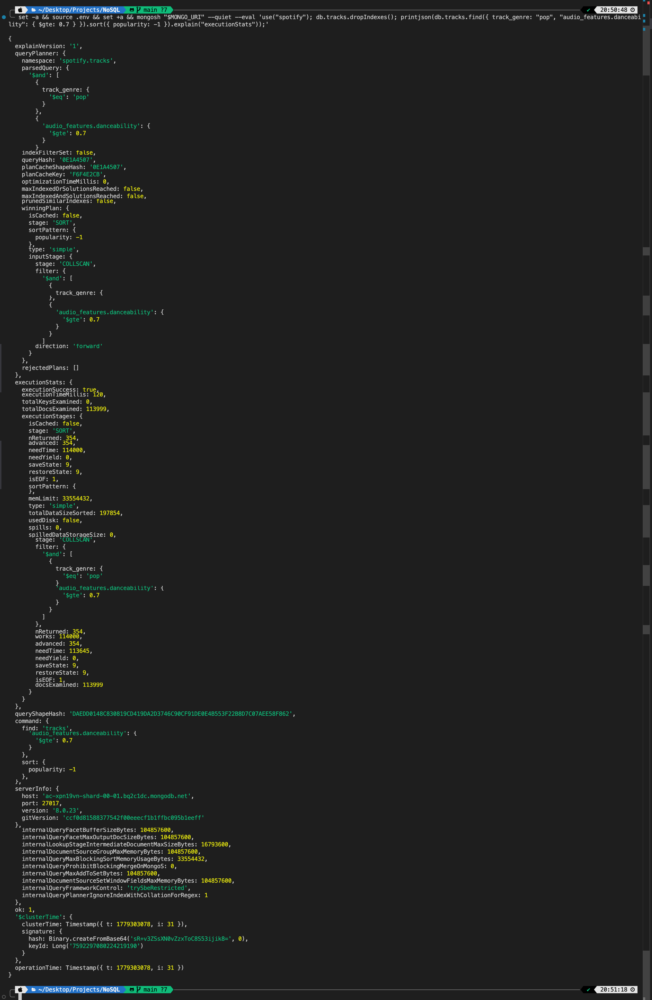
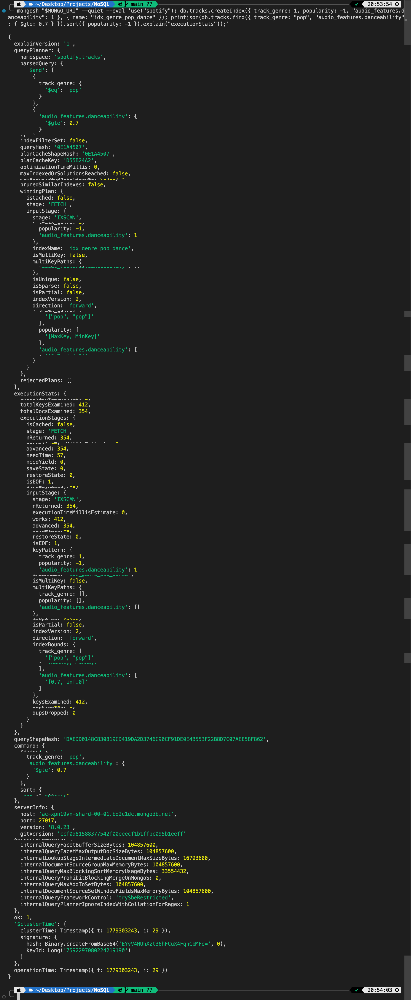
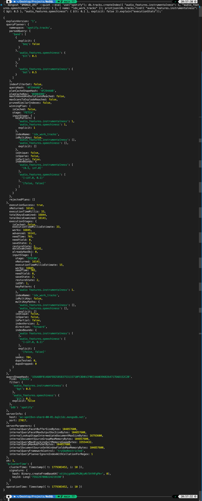

# Spotify NoSQL — MongoDB Atlas

Навчальний проєкт: завантаження датасету ~114 000 треків Spotify у MongoDB Atlas,
проєктування документоорієнтованої схеми через aggregation pipeline, написання
запитів, аналітичних агрегацій та оптимізація через індекси.

## Стек

- **MongoDB Atlas** (M0 Shared) — хмарне сховище.
- **Python 3** + `pymongo`, `pandas`, `python-dotenv`, `tqdm` — завантаження CSV.
- **mongosh** — виконання JS-скриптів трансформації, запитів та індексів.

## Структура

```
.
├── .env                        # рядок підключення (НЕ комітити, див. .env.example)
├── .gitignore
├── requirements.txt
├── dataset.csv                 # вхідні дані з Kaggle
├── scripts/
│   ├── 01_load_data.py         # CSV → tracks_raw
│   └── 02_transform.js         # tracks_raw → tracks (aggregation)
├── queries/
│   ├── part2_queries.js        # запити частини 2
│   ├── part3_aggregations.js   # пайплайни частини 3
│   └── part4_indexes.js        # індекси та explain() частини 4
├── docs/
│   └── outputs/                # скріни explain() + повні логи запуску
└── README.md
```

## Схема даних

Колекція **`spotify.tracks`** містить 113 999 документів. Підсумкова
структура отримана з `tracks_raw` через aggregation pipeline у
[scripts/02_transform.js](scripts/02_transform.js).

```jsonc
{
  "_id": ObjectId("6a0dff136b7aab809896dd92"),
  "track_id": "0WtM2NBVQNNJLh6scP13H8",      // Spotify ID треку
  "track_name": "Calm Down (with Selena Gomez)",
  "album_name": "Calm Down (with Selena Gomez)",
  "track_genre": "pop",                       // один з 114 жанрів
  "popularity": 92,                           // 0–100, з Spotify API
  "popularity_tier": "high",                  // обчислюване: high≥70, medium≥40, low<40
  "duration_ms": 239317,
  "duration_sec": 239.3,                      // обчислюване, з 1 знаком
  "explicit": false,
  "artists": [                                // масив, отримано split(";")
    "Rema",
    "Selena Gomez"
  ],
  "audio_features": {                         // вкладений об'єкт з 12 аудіо-фічами
    "danceability": 0.801,                    // 0–1
    "energy": 0.806,                          // 0–1
    "loudness": -5.206,                       // dB, типово −60…0
    "speechiness": 0.0381,                    // 0–1
    "acousticness": 0.382,                    // 0–1
    "instrumentalness": 0.000669,             // 0–1
    "liveness": 0.114,                        // 0–1
    "valence": 0.802,                         // 0–1, "позитивність" треку
    "tempo": 106.999,                         // BPM
    "key": 11,                                // 0–11 (C, C#, D, …)
    "mode": 1,                                // 0 = minor, 1 = major
    "time_signature": 4                       // 3–7
  }
}
```

**Чому така форма:**
- `artists` — **масив** (а не рядок з `;`), щоб підтримувати точний пошук
  по учаснику та multikey-індекс. Деталі — у відповіді [1.2](#12-чому-виконавці-зберігаються-як-масив-а-не-як-рядок).
- `audio_features` — **вкладений об'єкт**, бо це логічна група
  пов'язаних метрик. Деталі — у [1.1](#11-чому-аудіо-характеристики-винесені-в-окремий-обєкт-audio_features-а-не-зберігаються-плоско).
- `duration_sec` та `popularity_tier` — **обчислювані** під час трансформації,
  щоб не повторювати ту саму логіку в кожному запиті частини 2-3.

## Налаштування

### Передумови
- **Python 3.10–3.12** (`pandas==2.2.2` не підтримує Python 3.13+).
  На macOS: `brew install python@3.12`.
- **mongosh ≥ 2.0** для запуску `.js`-скриптів.
  На macOS: `brew install mongosh`.

### 1. Створіть кластер на MongoDB Atlas
- Зареєструйтеся на [mongodb.com/atlas](https://www.mongodb.com/atlas).
- Створіть кластер M0 (AWS, найближчий регіон).
- Database Access → створіть користувача з паролем.
- Network Access → додайте свій IP (або `0.0.0.0/0` для розробки).
- Connect → Drivers → скопіюйте connection string.

### 2. Локальне оточення

```bash
cp .env.example .env
# відредагуйте .env та вставте справжній MONGO_URI

python3.12 -m venv .venv
source .venv/bin/activate
pip install -r requirements.txt
```

### 3. Запуск пайплайна

`mongosh` читає `MONGO_URI` з `.env` — підвантажте його в поточну сесію:

```bash
set -a; source .env; set +a   # експортує MONGO_URI у поточний shell
```

Далі запускайте скрипти **по черзі** (кожна частина спирається на результат попередньої):

```bash
# Частина 1: завантаження та трансформація
python scripts/01_load_data.py
mongosh "$MONGO_URI" --quiet --file scripts/02_transform.js

# Частина 2: запити (4 завдання)
mongosh "$MONGO_URI" --quiet --file queries/part2_queries.js

# Частина 3: аналітика (3 завдання)
mongosh "$MONGO_URI" --quiet --file queries/part3_aggregations.js

# Частина 4: індекси та explain()
mongosh "$MONGO_URI" --quiet --file queries/part4_indexes.js
```

Усі скрипти **ідемпотентні** (повторний запуск не дублює даних): `01_load_data.py`
видаляє `tracks_raw` перед вставкою; `02_transform.js` пересоздає `tracks`
через `$out`; `part4_indexes.js` робить `dropIndexes()` перед `explain()` ДО.

## Результати запуску

Скрипти запускались на MongoDB Atlas M0 (AWS, eu-central-1), повні логи —
у `docs/outputs/`:

- [docs/outputs/part2_output.txt](docs/outputs/part2_output.txt) — 4 запити частини 2 (1917 рядків).
- [docs/outputs/part3_output.txt](docs/outputs/part3_output.txt) — 3 пайплайни частини 3 (148 рядків).
- [docs/outputs/part4_output.txt](docs/outputs/part4_output.txt) — повний `explain()` ДО/ПІСЛЯ
  кожного індексу (900 рядків).

**Ключові цифри:**

- `tracks_raw`: **113 999** документів (з вихідних 114 000 один рядок мав
  `NaN` у `artists`/`track_name` і був відфільтрований).
- `tracks`: **113 999** документів після трансформації.
- Топ-1 артист за середньою популярністю (≥ 5 треків) — **Olivia Rodrigo**, 87.4.
- Найбільш танцювальний жанр — **kids** (avg `danceability` = 0.779).
- Розподіл за настроєм: `happy` 43 404 / `angry` 38 761 / `sad` 23 086 / `calm` 8 748.

## Скріншоти `explain()` (Частина 4)

### ДО створення індексу (Завдання 1)

`stage: 'SORT'` → `'COLLSCAN'`, `totalDocsExamined: 113999`, `executionTimeMillis: 120`.



### ПІСЛЯ створення індексу (Завдання 1)

`stage: 'IXSCAN'`, `indexName: 'idx_genre_pop_dance'`, `totalDocsExamined: 354`,
`executionTimeMillis: 2`. Стадія `SORT` зникла — порядок забезпечує сам індекс.



### Індекс для work-tracks (Завдання 2)

`stage: 'IXSCAN'`, `indexName: 'idx_work_tracks'`, `nReturned: 16141`.



---

## Частина 1 — теоретичні питання

### 1.1. Чому аудіо-характеристики винесені в окремий об'єкт `audio_features`, а не зберігаються плоско?

Винесення в окремий об'єкт — це **логічне групування пов'язаних атрибутів**:

- Усі 12 аудіо-фіч (`danceability`, `energy`, `valence`, `tempo`, …) описують
  одну сутність — *звукові характеристики треку*. Тримати їх разом —
  природна нормалізація на рівні домену.
- Root-документ стає менш «галасливим»: метадані (`track_name`, `artists`,
  `popularity`) відокремлені від технічних метрик.
- Легше еволюціонувати схему: додавання нової аудіо-фічі не міняє
  верхнього рівня документа, не ламає клієнтів, які читають тільки метадані.
- Простіше **передавати/повертати** блок аудіо як одне ціле (наприклад,
  у відповіді API: `track.audio_features`).

**Коли вкладення вигідне:**
- Поля використовуються разом як єдиний блок.
- Поля рідко оновлюються по одному (низька write amplification).
- Документ не наближається до ліміту в 16 MB.
- Запити фільтрують по дочірніх полях нечасто, або є складений індекс.

**Коли вкладення створює проблеми:**
- Часті оновлення одного поля призводять до перезапису всього об'єкта.
- Потрібно індексувати багато полів усередині — індекси з префіксом
  `audio_features.` стають довгими, синтаксично шумними.
- Глибоке вкладення ускладнює запити: `find({ "a.b.c.d": ... })`.
- При використанні масивів усередині — обмеження multikey-індексів
  (не можна мати кілька multikey-полів у одному композитному індексі).

### 1.2. Чому виконавці зберігаються як масив, а не як рядок?

У CSV артисти приходять як рядок `"Beatles;John Lennon"` — це шкідливо
для запитів, бо вимагає `regex`/`$text`, які або повільні, або
неточні (можуть знайти підрядок `"John"` всередині `"Johnson"`).

Масив `["Beatles", "John Lennon"]` спрощує:

- **Точний пошук учасника:** `db.tracks.find({ artists: "Beatles" })` —
  multikey-індекс знаходить документ за O(log n).
- **Підрахунок треків артиста** — `$unwind: "$artists"` + `$group`.
- **Фільтр за кількістю учасників** — `$size`, `$expr`.
- **Кілька артистів одночасно** — `$in` (хоча б один), `$all` (усі мають бути).
- **Колаборації** — фільтр `{ "artists.1": { $exists: true } }` (мінімум 2 артисти).

### 1.3. Що таке `$out` і чим він відрізняється від `$merge`? Коли використовувати кожен?

| Аспект                | `$out`                                        | `$merge`                                      |
|-----------------------|-----------------------------------------------|-----------------------------------------------|
| Семантика             | Повна заміна цільової колекції                | Інкрементальна upsert/merge за ключем         |
| Атомарність           | Атомарно замінює колекцію (через rename)      | Документи пишуться по одному (не атомарно)    |
| Зберігання індексів   | НЕ зберігає індекси цільової колекції         | Зберігає індекси                              |
| Та сама колекція      | Не можна писати у вхідну колекцію             | Можна                                         |
| Інша БД               | З MongoDB 4.4+ — так                          | Так                                           |
| `whenMatched`/`...`   | Не підтримує                                  | Підтримує: `replace`, `merge`, `keepExisting`, `fail`, `pipeline`, `discard`, `insert` |
| Типовий use case      | Матеріалізована view, повна регенерація       | ETL з інкрементальним апдейтом, потокова обробка |

У цьому проєкті використовується `$out`: ми будуємо нову колекцію `tracks`
з нуля за один прохід, без потреби в інкрементальних оновленнях.

---

## Частина 2 — теоретичні питання

### 2.1. Для чого використовується `$unwind`?

`$unwind` розгортає поле-масив у документі: документ із масивом довжини N
перетворюється на N окремих документів — у кожного відповідне поле стає
скалярним елементом масиву.

```js
// Було (1 документ):
{ _id: 1, track_name: "X", artists: ["A", "B", "C"] }

// Стало (3 документи):
{ _id: 1, track_name: "X", artists: "A" }
{ _id: 1, track_name: "X", artists: "B" }
{ _id: 1, track_name: "X", artists: "C" }
```

Це потрібно щоб:
- Групувати по елементах масиву (наприклад, `$group: { _id: "$artists" }`
  для підрахунку треків на кожного учасника).
- Фільтрувати окремі елементи окремо.
- Робити `$lookup` по елементах.

Опція `preserveNullAndEmptyArrays: true` зберігає документи з порожніми
або відсутніми масивами (інакше вони відкидаються).

### 2.2. Чим `$stdDevPop` відрізняється від `$stdDevSamp`?

Обидва оператори обчислюють **стандартне відхилення**, але за різними формулами:

- `$stdDevPop` — *population standard deviation*, ділить суму квадратів
  відхилень на **N** (розмір популяції). Використовується, коли наявний
  датасет — це **вся популяція**, а не вибірка з неї.
- `$stdDevSamp` — *sample standard deviation*, ділить на **N − 1**
  (поправка Бесселя). Використовується, коли датасет — **вибірка** з
  більшої популяції; поправка дає незміщену оцінку дисперсії популяції.

У завданні 3 частини 2 усі треки конкретного жанру в нашій колекції
вважаються повною популяцією цього жанру (для цілей аналізу), тому
`$stdDevPop` коректніший. Якби ми вважали колекцію вибіркою (наприклад,
це лише фрагмент усього Spotify), правильніше було б `$stdDevSamp`.

Практична різниця при великих N (як 114 000) — мінімальна, але на
маленьких жанрах із кількома десятками треків `stdDevSamp` буде помітно
більший за `stdDevPop`.

---

## Частина 3 — теоретичні питання

### 3.1. Що зміниться при іншому порозі по треках у запиті №1?

**Поріг ≥ 1:** у топ-10 потрапляють *one-hit wonders* — артисти з єдиним
треком, який випадково має `popularity = 100`. Середнє популярності
дорівнює цій єдиній точці, тому такі артисти витискають із топу
будь-кого з кількома треками. Результат стає статистично нерепрезентативним:
ми описуємо не «стабільно популярних артистів», а «артистів з одним хітом».

**Поріг > 50:** залишаються лише дуже плідні артисти (мейджор-зірки,
DJ-збірки, виконавці типу `Various Artists`, класичні композитори з
великими каталогами). Середня тягне вниз через велику кількість
старих/нішевих треків з низькою популярністю, тому абсолютне значення
середньої популярності буде нижче, ніж при порозі 5. Тoп складається з
артистів-«мегаваг», що мають і хіти, і архів.

**Поріг 5** — компроміс: відсікає випадковий шум однохітових артистів,
але не вимагає величезного каталогу. Виходять представники з кількома
впізнаваними треками.

### 3.2. Що зміниться при порозі по жанрах 50 замість 100?

Поріг — це фільтр статистичної надійності середніх. При 50 треках
стандартна похибка середнього (`σ / √n`) приблизно в `√2 ≈ 1.41` разів
більша, ніж при 100. Тому:

- У вибірку потрапить більше нішевих жанрів, у яких випадкова підбірка
  може мати штучно високу `danceability`.
- Порядок у топі може помінятись, особливо в кінці списку.
- Загальні лідери — `latin`, `hip-hop`, `reggaeton`, `dance` — лишаються
  на місці (вони мають значно більше 100 треків в обох випадках).

Поріг 100 — це **захист від випадкового топ-1** маленького жанру.
Зі зниженням порогу зростає шум, але не ризик повністю спотворити
картину — у Spotify-датасеті більшість жанрів мають по 1 000 треків.

---

## Частина 4 — індекси та explain()

### Завдання 1. Аналіз ресурсоємного запиту

Запит:

```js
db.tracks.find({
  track_genre: "pop",
  "audio_features.danceability": { $gte: 0.7 }
}).sort({ popularity: -1 });
```

Створений індекс (правило **ESR** — Equality → Sort → Range):

```js
db.tracks.createIndex({
  track_genre: 1,                     // Equality
  popularity: -1,                     // Sort
  "audio_features.danceability": 1    // Range
});
```

**Що змінилося в плані виконання** (реальні значення з нашого M0-кластера, 113 999 документів):

| Поле з `executionStats`     | ДО індексу                  | ПІСЛЯ індексу                                  |
|------------------------------|------------------------------|-------------------------------------------------|
| `winningPlan.stage`          | `SORT` → `COLLSCAN`          | `FETCH` → `IXSCAN`                              |
| `winningPlan.indexName`      | —                            | `idx_genre_pop_dance`                           |
| `nReturned`                  | 354                          | 354                                             |
| `totalDocsExamined`          | **113 999** (вся колекція)   | **354** (рівно скільки повернули)               |
| `totalKeysExamined`          | 0                            | 412                                             |
| `executionTimeMillis`        | **86 мс**                    | **2 мс** (~43× швидше)                          |
| Стадія `SORT`                | Присутня (in-memory)         | Відсутня — порядок дає сам індекс               |

Скріншоти цього порівняння — на початку README у секції
[Скріншоти `explain()`](#скріншоти-explain-частина-4).

**Як зрозуміти, що індекс використовується:**

- `executionStats.executionStages.stage` починається з `IXSCAN`
  (а не `COLLSCAN`).
- `winningPlan.inputStage.indexName` = `"idx_genre_pop_dance"`.
- `totalKeysExamined > 0` — індексні ключі справді читалися.
- `totalDocsExamined` значно менше за загальну кількість документів у
  колекції.
- Якщо порядок сортування збігається з порядком індексу, стадія `SORT`
  у плані відсутня (індекс уже віддає документи в потрібному порядку).

### Завдання 2. Індекс для пошуку музики для роботи

```js
db.tracks.createIndex({
  "audio_features.instrumentalness": 1,
  "audio_features.speechiness": 1,
  explicit: 1
});
```

Цільовий запит:

```js
db.tracks.find({
  "audio_features.instrumentalness": { $gt: 0.5 },
  "audio_features.speechiness":      { $lt: 0.1 },
  explicit: false
});
```

Порівняння `explain("executionStats")` ДО і ПІСЛЯ створення індексу
(числа з нашого M0-кластера):

| Поле з `executionStats`     | ДО індексу                  | ПІСЛЯ індексу                      |
|------------------------------|------------------------------|-------------------------------------|
| `winningPlan.stage`          | `COLLSCAN`                   | `FETCH` → `IXSCAN`                  |
| `winningPlan.indexName`      | —                            | `idx_work_tracks`                   |
| `nReturned`                  | 16 141                       | 16 141                              |
| `totalDocsExamined`          | **113 999** (вся колекція)   | **16 141** (рівно скільки повернули)|
| `totalKeysExamined`          | 0                            | 16 844                              |
| `executionTimeMillis`        | **123 мс**                   | **39 мс** (~3.2× швидше)            |

Скрін `explain()` ПІСЛЯ індексу — на початку README в секції
[Скріншоти `explain()`](#скріншоти-explain-частина-4) (`explain_work.png`).

**Чому прискорення «всього» 3.2× (а не 43× як у завданні 1)?** Фільтр повертає
16 141 документ — це **14% усієї колекції**. MongoDB все одно мусить зробити
`FETCH` для кожного з них, бо ми не використовуємо проєкцію. Великий
`nReturned` обмежує виграш від індексу: чим більше документів повертає
запит, тим менша частка часу витрачається на пошук і тим більша — на
читання документів. Якби запит повертав, скажімо, 100 треків, прискорення
було б порівнянне з завданням 1.

> **Примітка про ESR.** У цьому індексі всі три поля використовуються в
> діапазонних/рівнісних умовах. Поле `explicit` — це рівність (`= false`),
> тому суто за ESR його варто було б поставити першим. Однак у завданні
> прямо вказано порядок `instrumentalness → speechiness → explicit`,
> тому залишаємо його. Для продакшну я б змінив на
> `{ explicit: 1, "audio_features.instrumentalness": 1, "audio_features.speechiness": 1 }`
> — це дало б ефективніше відсічення `explicit = false` ще на рівні B-tree.

### Завдання 3. Чи є запит покривним (covered)?

Запит:

```js
db.tracks.find({ track_genre: "pop", popularity: { $gte: 70 } });
```

Індекс із завдання 1: `{ track_genre: 1, popularity: -1, audio_features.danceability: 1 }`.

**Відповідь: ні, цей запит НЕ покривний.**

Покривний запит — це такий, де MongoDB може повністю обслужити запит
лише з індексу, без читання документів із колекції. Для цього мають
одночасно виконуватися **три умови**:

1. Усі поля з фільтра присутні в індексі.
2. Усі поля з проєкції (включно з тим, що повертає `find`) теж в індексі.
3. У проєкції `_id: 0` (або `_id` теж є в індексі, що для звичайного
   `ObjectId`-індексу нетипово).

Розбираємо запит:

- **Поля фільтра.** `track_genre` (eq) і `popularity` (range) — обидва є
  в індексі. Умова (1) виконана.
- **Поля проєкції.** `find()` без другого аргументу — це проєкція
  «повертай усі поля». В індексі немає `track_name`, `artists`,
  `audio_features` (крім `danceability`), `_id` тощо. Умова (2)
  **порушена** — MongoDB має дочитати документи через `FETCH`.
- **`_id`.** За замовчуванням повертається — а `_id` в індексі немає.
  Умова (3) теж **порушена**.

У `explain()` буде видно `winningPlan.inputStage.stage: "FETCH"` над
`IXSCAN`, а `executionStats.totalDocsExamined > 0` — це і є ознака
непокривного запиту.

**Підтвердження з нашого `part4_indexes.js`:**

| Метрика              | `find()` без проєкції | `find()` з проєкцією `{_id:0, track_genre:1, popularity:1}` |
|----------------------|------------------------|---------------------------------------------------------------|
| `winningPlan.stage`  | `FETCH` → `IXSCAN`     | **`PROJECTION_COVERED` → `IXSCAN`**                           |
| `totalKeysExamined`  | 317                    | 317                                                           |
| `totalDocsExamined`  | **317**                | **0** ← документи взагалі не читалися                         |
| `nReturned`          | 317                    | 317                                                           |

Друга стадія `PROJECTION_COVERED` — пряме свідчення MongoDB, що
**усі дані повернуті прямо з індексу**, без жодного звернення до колекції.

**Як зробити покривним:**

```js
db.tracks.find(
  { track_genre: "pop", popularity: { $gte: 70 } },
  { _id: 0, track_genre: 1, popularity: 1 }   // тільки індексовані поля
);
```

Тут проєкція тримає лише `track_genre` і `popularity` (обидва в індексі)
та виключає `_id`. У `explain()` зникає стадія `FETCH` і з'являється
`PROJECTION_COVERED`, а `totalDocsExamined` стає **0**.
